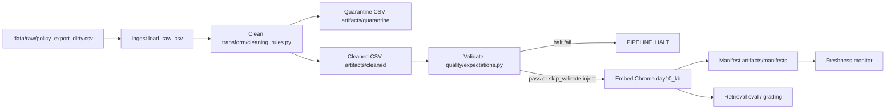

# Kiến trúc pipeline - Lab Day 10

**Nhóm:** DoTuanDat  
**Cập nhật:** 2026-06-10

---

## 1. Sơ đồ luồng

`run_id` được ghi ngay đầu log và trong manifest. Freshness được đo sau publish dựa trên `latest_exported_at` trong manifest. Mỗi run sinh cleaned CSV và quarantine CSV riêng để truy vết lineage.

---

## 2. Ranh giới trách nhiệm

| Thành phần | Input | Output | Owner nhóm |
|------------|-------|--------|------------|
| Ingest | `data/raw/policy_export_dirty.csv` | raw rows + `raw_records` | Ingestion / Raw Owner |
| Transform | raw rows | cleaned rows + quarantine rows | Cleaning & Quality Owner |
| Quality | cleaned rows | expectation results + halt decision | Cleaning & Quality Owner |
| Embed | cleaned CSV | Chroma collection `day10_kb` | Embed & Idempotency Owner |
| Monitor | manifest JSON | PASS/WARN/FAIL freshness status | Monitoring / Docs Owner |
| Eval | Chroma collection + questions JSON | CSV/JSONL evidence | Embed & Monitoring Owners |

---

## 3. Idempotency & rerun

Embed publish dùng snapshot semantics. Pipeline tạo `chunk_id` ổn định từ `doc_id`, text sau clean, và sequence; Chroma `upsert` theo `chunk_id`. Trước upsert, pipeline đọc các id hiện có trong collection và prune những id không còn nằm trong cleaned run mới. Vì vậy rerun cùng input không làm phình vector store.

Evidence Sprint 2/Sprint 3:

- `run_2026-06-10T06-39Z.log`: sau enrichment có `embed_prune_removed=9`, `embed_upsert count=27`.
- `run_2026-06-10T06-40Z.log`: rerun cùng snapshot không prune thêm, `embed_upsert count=27`.
- `run_sprint3-clean-good.log`: recovery clean prune dirty ids, `embed_prune_removed=35`, rồi upsert 27 clean chunks.

---

## 4. Liên hệ Day 09

Day 10 publish corpus sạch vào Chroma collection `day10_kb`. Day 09 supervisor/worker có thể dùng cùng nội dung policy/refund/SLA/FAQ/HR/access control, nhưng nên trỏ retrieval worker sang collection đã publish của Day 10 thay vì đọc trực tiếp raw docs. Cách tách collection giúp debug data layer độc lập: nếu grading sai, kiểm tra manifest/log/expectation trước khi sửa prompt hay router Day 09.

---

## 5. Rủi ro đã biết

- `artifacts/` bị `.gitignore`, cần nộp kèm nếu LMS yêu cầu file evidence.
- Freshness trên sample data đang FAIL vì timestamp cũ hơn SLA 24h; đây là monitor signal chứ không phải clean failure.
- `grading_questions.json` bị ignore theo rubric, nên khi file không có thì dùng `data/test_questions.json` cho self-check.
- Inject mode `--no-refund-fix --skip-validate` chỉ dùng cho Sprint 3; không dùng trong publish chuẩn.
